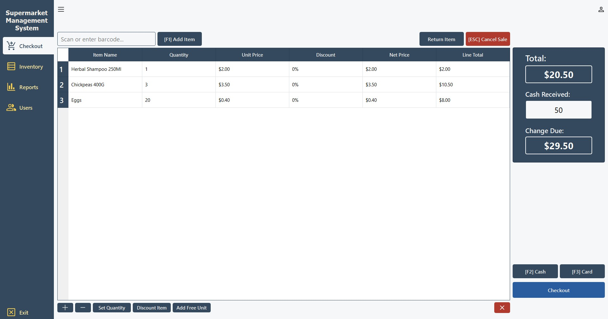
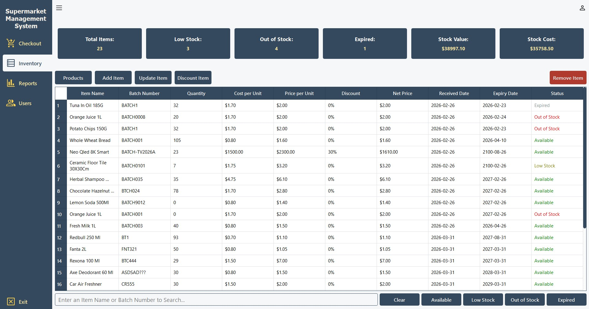
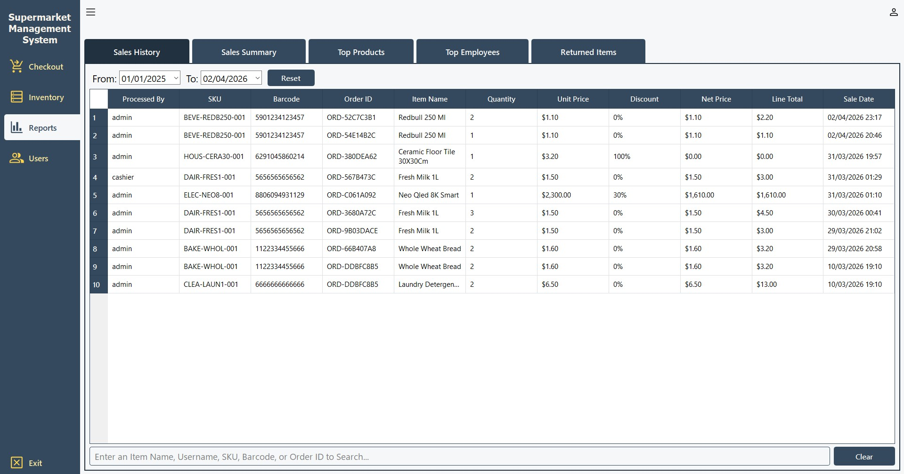
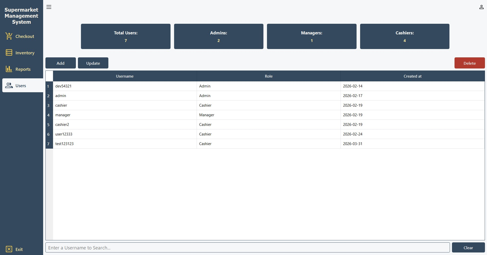
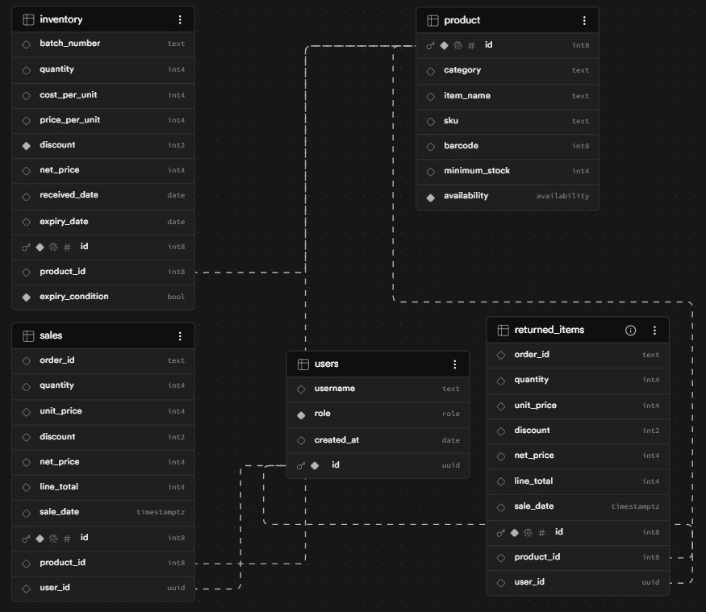

# Supermarket Management System

**Supermarket Management System** is a desktop application built with Python and PySide6 for managing day-to-day supermarket operations — from checkout and inventory to sales reports and staff accounts. It connects to a Supabase backend and enforces role-based access so each staff member only sees what they need.

---

## Screenshots

### Application





&nbsp;

### Database Schema


---

## Key Features

| Feature | Description |
|---|---|
| **Role-Based Login** | Admin, Manager, and Cashier roles with separate access levels |
| **Checkout** | Barcode scanning, real-time price calculation, discounts, and payment methods |
| **Inventory Management** | Add, update, delete, and search items with stock status tracking |
| **Sales Reports** | Sales history, summary, top products, and top employees filtered by date |
| **User Management** | Create, update, and delete staff accounts (Admin only) |
| **Returns** | Process full or partial item returns linked to original orders |

---

## Technologies Used

- **Python 3.10+**
- **[PySide6](https://doc.qt.io/qtforpython/)** — Qt-based GUI framework
- **Qt Designer** — Visual UI design via `.ui` files
- **[Supabase](https://supabase.com/)** — PostgreSQL database, authentication, and row-level security

---

## Setup Instructions

### Option 1 — Run from Source

1. **Clone the repository**
   ```bash
   git clone https://github.com/toghrul96/Supermarket-Management-System
   cd supermarket-manager
   ```

2. **Install dependencies**
   ```bash
   pip install -r requirements.txt
   ```

3. **Configure environment**

   Create a `.env` file in the project root:
   ```
   SUPABASE_URL=your_supabase_url
   SUPABASE_KEY=your_supabase_anon_key
   ```

4. **Launch the app**
   ```bash
   python log_in.py
   ```

### Option 2 — Windows Installer

Download the latest `Supermarket.Management.System-Setup.exe` from the [Releases](https://github.com/toghrul96/Supermarket-Management-System/releases/) page and run it. No Python installation required.

---

## Project Structure

```
supermarket-manager/
├── models/
│   ├── user.py          # User authentication and management
│   ├── inventory.py     # Inventory and product logic
│   └── sales.py         # Sales recording and reporting
├── ui/                  # Qt Designer generated UI files
├── icons/               # App icons and image assets
├── main.py              # Main application window
├── log_in.py            # Entry point / login window
├── popups.py            # Popup dialog windows
├── worker.py            # Background thread worker
└── requirements.txt
```

---

## Default Roles

| Role | Access |
|---|---|
| **Admin** | Full access — checkout, inventory, reports, user management |
| **Manager** | Checkout, inventory, and reports |
| **Cashier** | Checkout only |

---

## License

This project is licensed under the MIT License. See [`LICENSE`](LICENSE) for details.
